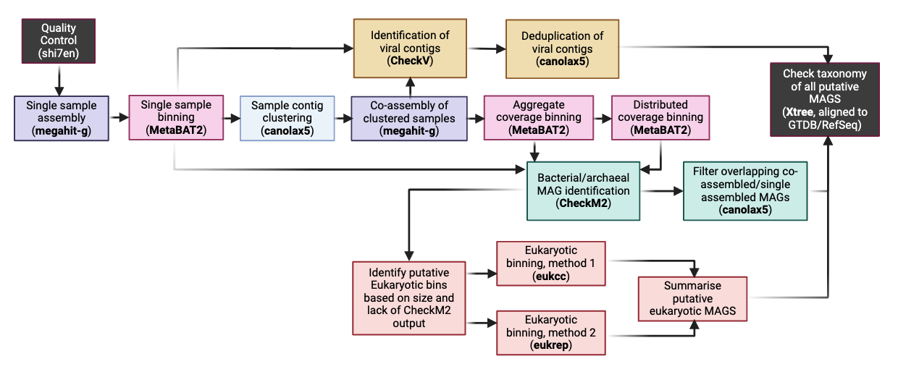

# MAGUS: Pan-domain, holobiont characterization via co-assembly binning emphasizing low abundance organisms

## Background

The term "holobiont" refers to the assemblage of all organisms that make up a single meta-organism. This could be humans and their resident microbes, corals and their native viruses and algae, or any other number of metagenomic ecosystems. Given the complex interplay between microbes and their hosts, studying the macroscale holobiont instead of individual systems in isolation is critical for understanding ecosystem dynamics on a biologically meaningful scale. 

However, in DNA sequencing-based metagenomic analysis, we tend to bias our efforts to studying only high abundance organisms within a specific branch of the tree of life. For example, metagenomic binning in pursuit of resolving species genomes tends to emphasize bacteria, despite the fact that bacteria rarely exist in nature only with other bacteria -- this usually only happens in lab settings that are designed by us humans. Further, our metagenomic sequencing, when considered on a sample-by-sample basis, is highly biased to high-abundance microbes, ones that dominate the captured sequences from a sample. As a result, binning and other methods miss some ecologically critical, low-abundance organisms.

Here, we provide MAGUS -- a pipeline designed for pan-domain analysis of the holobiont, capturing low abundance organisms via a co-assembly-based method. Taking sequencing datasets as input, we return 1) bacterial/archaeal, 2) viral, and 3) putative eukaryotic MAGs. Our initial focus is on systematic characterization of coral holobionts, but in principle this toolkit can be used for any ecosystem where low abundance organisms are of interest.

## Approach



MAGUS takes a multi-pass, single then co-assembly approach to identify putative metagenomic bins. For assembly, we use the bundled `megahit-g` implementation from `bin/`. Following single sample assembly, we run MetaBAT2 in order to identify putative bins. Samples are then selected for coassembly based on jaccard distance between assembled contigs, with the hypothesis being that samples with a certain degree of similarity will be more likely to assemble low abundance bins that were missed in single assembly. Following coassembly, binning is attempted both with aggregated coverage (i.e., without alignment to compute individual coverages) as well as distributed coverage (using alignment). We use CheckM2 to identify putative bacteria/archaea, CheckV to get viruses, and two Eukaryotic binners (EukCC and EukRep) to identify putative eukaryotic bins. Viral genomes are dereplicated at the 90% identity level. Identical bacterial/archaeal genomes are consolidated between coassembled and single assembled samples. Eukaryotic genomes are not dereplicated. 

## Installation

MAGUS was built and runs quite happily on Fedora Linux 40 (Workstation Edition). 

When we preprint the paper, we'll have a docker container you can just pull.

```bash
git clone https://github.com/two-frontiers-project/2FP_MAGUS.git   
cd 2FP_MAGUS
conda env create -f magus.yaml
conda activate magus
pip install .
```

If you prefer not to install the package, make sure the repository's `bin/` directory
is on your `PATH` so bundled tools (e.g., `megahit-g`, `checkm2`, `hmmsearch-g`) are available.

Now, if you want to run EukRep, you will have to run it into its own conda environment. The models it uses for genome prediction were trained with an older version of ```scikit-learn``` than is required by CheckM2, which is a more critical tool for MAGUS overall. We have forked EukRep's repo and are playing around with updating the dependency versioning, but for the time being it's easier to install EukRep in a conda environment (`eukrep-env` is what MAGUS looks for by default, you can update this in the config files). In the find-euks step, MAGUS will activate then deactivate this environment as needed.

Here's the link to EukRep:

```https://github.com/patrickwest/EukRep```

To install (either via the provided environment file or via bioconda):

```
conda env create -f eukrep-env.yml
```

```
conda create -y -n eukrep-env -c bioconda scikit-learn==0.19.2 eukrep
```

## Database and config setup

You'll notice MAGUS is designed to not be run in a single click (we have no end-to-end implmentation) -- this is intentional, as not all users will need to run it fully, and the co-assembly steps are extraordinarily memory intensive. 

Additionally, we parameterize the different functions based on config files (located by default in the `configs/` directory). These provide paths to the sequencing files you want to process, as well as the raw database locations (this is to avoid muddying up your paths and prevent having to manually specify database locations in each steps). 

So, before running MAGUS **be sure that you update the db_locs config file with the appropriate paths to raw data and databases on your system.**

## Input and output

In its maximal form, when you run MAGUS you'll end up with a single directory that contains:

1. Bacterial MAGS
2. Viral Genomes
3. Putative Eukaryotic MAGS
4. Taxonomic information on every MAG
5. Summarized quality statistics for each MAG

You'll also end up, of course, with all your assemblies, and in the near future you'll have gene catalogs, functional annotations, and phylogenies.

## A note on runtimes and memory usage

This is a **wildly** memory intensive piece of software. It is not meant to be run on personal machines. Single assemblies are easy enough, but co-assemblies can easily require 3+ terabytes of RAM. It can take weeks to work through only a few hundred samples, even if they're sub 100M PE reads. We're working on some methods for clever downsampling to speed things up in the coassembly step without losing critical information, but in the meantime we recommend leveraging HPC systems, cloud credits, and leveraging spot instances. If you have specific challenges, please feel free to reach out to ```info at two frontiers dot org.```

## Commands and arguments

MAGUS exposes the following sub-commands through `magus <command>`:

| Command | Description |
| --- | --- |
| `magus qc` | Run read QC and compression with `shi7_trimmer` and `minigzip`. |
| `magus assemble-hosts` | Generate host assemblies and clustering metadata used to mask dominant genomes prior to metagenomic processing. |
| `magus subsample-reads` | Down-sample reads with `seqtk` and emit an updated config file. |
| `magus filter-reads` | Remove reads matching host references using xtree `.perq` output. |
| `magus taxonomy` | Run xtree on raw reads to generate coverage, taxonomy, and abundance summaries. |
| `magus single-assembly` | Assemble each sample independently with MEGAHIT. |
| `magus binning` | Bin single-assembly contigs with MetaBAT2 and assess quality with CheckM2. |
| `magus cluster-contigs` | Collect filtered contigs, perform clustering, and build the co-assembly task list. |
| `magus coassembly` | Execute co-assemblies for grouped samples. |
| `magus coassembly-binning` | Bin co-assembly results and evaluate bins with CheckM2. |
| `magus finalize-bacterial-mags` | Merge redundant bacterial/archaeal MAGs across single and co-assemblies. |
| `magus find-viruses` | Merge contigs, run CheckV, and dereplicate viral genomes. |
| `magus find-euks` | Identify putative eukaryotic genomes using EukRep and EukCC. |
| `magus dereplicate` | Dereplicate MAGs with lingenome and canolax5. |
| `magus call-orfs` | Call open reading frames across MAG collections. |
| `magus annotate` | Run hmmsearch-based annotations against Pfam/PGAP or custom HMM databases. |
| `magus build-gene-catalog` | Build pan-genome gene catalogs from ORF predictions. |
| `magus consolidate-gene-catalog` | Merge gene catalogs with annotation tables and optional metadata. |
| `magus filter-mags` | Filter MAGs using xtree alignment statistics. |
| `magus build-tree` | Construct phylogenetic trees from concatenated single-copy genes. |

### Command arguments

Key options for each command are summarised below (see `magus <command> --help` for complete details):

- **qc** (`magus qc`)
  - `--config`: TSV describing raw reads.
  - `--slurm_config`: Slurm settings TSV (optional).
  - `--max_workers`: Parallel samples to process at once (default: 1).
  - `--mode`: `local` or `slurm` execution mode (default: local).
  - `--seqtype`: `short` or `long` reads (default: short).
  - `--outdir`: Output directory for QC results (default: qc).
- **assemble-hosts** (`magus assemble-hosts`)
  - `--config`: TSV of reads to subsample for host assembly.
  - `--max_workers`: Parallel samples (default: 1).
  - `--threads`: Threads for preprocessing (default: 14).
  - `--ksize`: Number of clusters to seek (default: 0, auto via silhouette).
  - `--output_config`: Destination for the host-filtering config (default: configs/host_assembly_config).
  - `--tmpdir`: Working directory for intermediate host files (default: tmp).
- **subsample-reads** (`magus subsample-reads`)
  - `--config`: Input sequencing config.
  - `--outdir`: Directory for subsampled reads (default: subsampled_reads).
  - `--out_config`: Path for the updated config file (default: configs/subsampled_reads_config).
  - `--depth`: Target read count per sample (default: 100000000).
  - `--threads`: Parallel threads (default: 4).
  - `--max_workers`: Concurrent workers (default: 4).
- **filter-reads** (`magus filter-reads`)
  - `--config`: Sequencing config aligning filenames to read pairs.
  - `--perq_dir`: Directory containing xtree `.perq` files.
  - `--output_dir`: Where filtered reads are written (default: filtered_reads).
  - `--min_kmers`: Minimum k-mer evidence retained per read (default: 10).
  - `--max_workers`: Parallel samples (default: 1).
  - `--threads`: Threads for seqkit (default: 1).
- **taxonomy** (`magus taxonomy`)
  - `--config`: TSV mapping sample IDs to read locations.
  - `--output`: Output directory for alignments and summaries (default: magus/xtree_output).
  - `--db`: xtree database to query.
  - `--threads`: Threads per xtree run (default: 4).
  - `--max_workers`: Parallel samples (default: 1).
  - `--taxmap`: GTDB taxonomy file (optional).
  - `--coverage-cutoff`: Coverage cutoff for merged abundance matrix (default: 0.05).
  - `--skip-perq`, `--skip-cov`, `--skip-ref`: Skip selected xtree outputs.
- **single-assembly** (`magus single-assembly`)
  - `--config`: QC'd read configuration.
  - `--slurm_config`: Slurm settings TSV (optional).
  - `--max_workers`: Number of samples assembled in parallel (default: 1).
  - `--threads`: Threads for assembly (default: 14).
  - `--mode`: `local` or `slurm` execution mode (default: local).
  - `--seqtype`: `short` or `long` reads (default: short).
  - `--meta`: Use metaFlye for long-read assemblies (default).
  - `--low_complexity`: Use Flye low-complexity mode for long reads.
- **binning** (`magus binning`)
  - `--config`: Assembly config file (expects `filename`, `pe1`, `pe2`).
  - `--asmdir`: Location of assemblies to bin (default: asm).
  - `--tmpdir`: Scratch directory for binning intermediates (default: tmp/binning).
  - `--threads`: Threads for MetaBAT2 and CheckM2 (default: 14).
  - `--max_workers`: Parallel samples (default: 4).
  - `--checkm_db`: Optional CheckM database override.
  - `--test_mode`: Relax filters and generate fallback bins.
  - `--completeness`: Completeness threshold override.
  - `--contamination`: Contamination threshold override.
  - `--restart`: Restart at `binning`, `checkm`, or `filtering`.
  - `--low-quality`, `--medium-quality`, `--high-quality`: Preset quality thresholds (mutually exclusive).
- **cluster-contigs** (`magus cluster-contigs`)
  - `--config`: Same config used for single assemblies.
  - `--threads`: CPU threads for clustering utilities (default: 28).
  - `--contig_dir`: Directory for filtered contigs (default: contigs).
  - `--combined_output`: Output filename for merged contigs (default: Contigs.fasta).
  - `--asmdir`: Source assemblies (default: asm/).
  - `--magdir`: Source MAGs (default: asm/mags/).
  - `--tmpdir`: Workspace for clustering output (default: tmp/cluster-contigs).
  - `--ksize`: Manual K for spamw2 (default: 0 = silhouette/auto).
  - `--use_stat_cutoff`: Use spamw2 `.stat` file when running bestmag2.
  - `--stat_file`: Path to spamw2 `.stat` file (used with `--use_stat_cutoff`).
  - `--assemblies_only`: Skip MAG filtering and cluster assemblies directly.
- **coassembly** (`magus coassembly`)
  - `--config`: Sequencing config.
  - `--coasm_todo`: Task list generated by `cluster-contigs`.
  - `--outdir`: Destination for co-assembly results (default: coasm).
  - `--tmpdir`: Working directory for co-assembly intermediates (default: tmp/coasm).
  - `--threads`: Threads allocated per co-assembly (default: 48).
  - `--test_mode`: Relax filters and generate fallback bins.
- **coassembly-binning** (`magus coassembly-binning`)
  - `--config`: Sequencing config.
  - `--coasm_outdir`: Root of co-assembly outputs to process (default: coasm).
  - `--tmpdir`: Scratch directory for binning (default: tmp/coassembly-binning).
  - `--threads`: Threads (default: 28).
  - `--max_workers`: Parallel co-assemblies (default: 4).
  - `--checkm_db`: Optional CheckM database override.
  - `--test_mode`: Relax filtering thresholds and generate fallback bins.
  - `--restart`: Restart at `binning`, `checkm`, or `filtering`.
- **finalize-bacterial-mags** (`magus finalize-bacterial-mags`)
  - `--singleassembly_mag_dir`: Single-assembly MAGs (default: asm/mags).
  - `--coasm_mag_dir`: Co-assembly MAGs (default: coasm/mags).
  - `--outdir`: Final MAG export directory (default: magus_output/magus_bacteria_archaea).
  - `--threads`: CPU threads for dereplication (default: 28).
  - `--tmpdir`: Temporary directory for merging work (default: tmp/finalize-bacterial-mags).
- **find-viruses** (`magus find-viruses`)
  - `--asm_paths` *or* `--config`: Supply assemblies to scan (mutually exclusive).
  - `--combined_contig_file`: Filename for merged contigs (default: all_contigs.fasta).
  - `--filtered_contig_file`: Filename for filtered contigs (default: filtered_all_contigs.fasta).
  - `--min_length`: Minimum contig length (default: 500).
  - `--max_length`: Maximum contig length (default: 1000000000).
  - `--threads`: Threads for CheckV (default: 28).
  - `--quality`: Quality tiers to keep (default: CHM).
  - `--tmpdir`: Scratch directory for CheckV runs and dereplication (default: tmp/run_checkv).
  - `--checkv_db`: CheckV database location (required).
  - `--restart cleanup`: Resume downstream processing after CheckV completes.
- **find-euks** (`magus find-euks`)
  - `--bin_dirs`: Pipe-delimited directories to search for bins (required).
  - `--wildcards`: Pipe-delimited patterns to match bins (default: empty string).
  - `--size_threshold`: Minimum bin size (default: 10000000).
  - `--euk_binning_outputdir`: Output directory (default: magus_output/magus_euks).
  - `--dblocs`: Mapping file for database paths (expects `eukccdb`, required).
  - `--max_workers`: Parallel bins (default: 1).
  - `--threads`: Threads for EukCC (default: 8).
  - `--skip_eukrep`: Skip EukRep.
  - `--skip_eukcc`: Skip EukCC.
  - `--eukrep_env`: Conda environment name for EukRep.
  - `--checkm2_file`: Optional CheckM2 quality report file.
- **dereplicate** (`magus dereplicate`)
  - `-m`, `--mag_dir`: Path or glob to MAGs (required).
  - `--tmpdir`: Working directory (default: tmp).
  - `--threads`: Threads for canolax5 (default: 4).
  - `--extension`: MAG file extension (default: fa).
  - `-w`, `--wildcard`: Path pattern filter.
  - `-o`, `--output`: Output directory (default: dereplicated_genomes).
  - `-k`, `--kmer_size`: K-mer size (default: 16).
  - `--max_genome_size`: Maximum genome size for trimming (default: 2000000000).
- **call-orfs** (`magus call-orfs`)
  - `--config`: Tab-delimited config file (sample_id, genome_path, domain).
  - `-m`, `--mag_dir`: Path or glob to genome files.
  - `-w`, `--wildcard`: Pipe-delimited path filters.
  - `--domain`: Domain when using `--mag_dir` (`bacterial`, `viral`, `eukaryotic`, `metagenomic`).
  - `--output_directory`: Output directory (default: magus_output/orf_calling).
  - `--max_workers`: Parallel ORF jobs (default: 1).
  - `--threads`: Threads per tool (default: 4).
  - `--extension`: Genome file extension (default: fa).
  - `--force`: Overwrite existing outputs.
  - `--eukdb`: MetaEuk UniRef90 DB path (default: data/uniref90).
- **annotate** (`magus annotate`)
  - `--output_directory`: Root ORF output directory (default: magus_output/orf_calling).
  - `--faa_dir`: Directory containing .faa files to annotate (overrides discovery and processes only those files; ignores `--domains`).
  - `--sequence-dir`: Directory containing FASTA files to annotate.
  - `--sequence-file`: Single FASTA file to annotate.
  - `--split-file-size`: Sequences per split file when using `--sequence-file` (default: 100000).
  - `-x`, `--extension`: Extension for `--sequence-dir` (default: faa).
  - `--domains`: Comma-separated domains to process (default: bacteria,viruses,metagenomes,eukaryotes).
  - `--threads`: Threads per hmmsearch-g job (default: 8).
  - `--max_workers`: Parallel samples (default: 4).
  - `--pfam_tsv`, `--pgap_tsv`, `--pfam_db`, `--pgap_db`: Required for default Pfam/PGAP mode.
  - `--Z_pfam`, `--Z_pgap`: Database sizes for Pfam/PGAP (defaults: 25545/18057).
  - `--hmmdb`: Custom HMM database (user mode; requires `--evalue_full` or `--evalue_dom`).
  - `--suffix`: Output suffix tag for user mode (default: custom).
  - `--evalue_full`, `--evalue_dom`: E-value cutoffs for user mode.
  - `--no_cut_ga`: Disable `--cut_ga`.
  - `--Z`: Database size for user mode.
- **build-gene-catalog** (`magus build-gene-catalog`)
  - `--sequence-dir`: Directory containing FASTA files.
  - `--sequence-file`: Single FASTA file to cluster.
  - `-x`, `--extension`: File extension to match when using `--sequence-dir` (default: faa).
  - `--output-dir`: Output directory for the gene catalog (required).
  - `--threads`: Threads for MMseqs2 (default: 1).
  - `--identity-threshold`: Single clustering threshold (default: 0.9).
  - `--identity-thresholds`: Comma-separated thresholds for iterative clustering.
  - `--coverage-threshold`: Coverage threshold for clustering (default: 0.8).
  - `--tmpdir`: Temporary directory for MMseqs2 (default: ./tmp/).
  - `--split-singletons`: Write singleton/non-singleton catalog files.
- **consolidate-gene-catalog** (`magus consolidate-gene-catalog`)
  - `--gene-catalog`: Gene catalog TSV from build-gene-catalog (required).
  - `--annotations`: Merged annotations TSV from annotate (required).
  - `--output`: Output consolidated catalog TSV (required).
  - `--annotation-merge-column`: Catalog column name/threshold to merge into (default: last column).
  - `--harmonize-annotations`: Insert harmonized identity column.
  - `--additional-gene-metadata`: Optional gene metadata TSV.
  - `--sample-metadata`: Optional sample metadata TSV.
- **filter-mags** (`magus filter-mags`)
  - `--output-dir`: Filtered MAG destination.
  - `--perq-dir`: Directory housing xtree `.perq` files.
  - `--mag-dir`: MAG directory to filter.
  - `--kmer-threshold`: Evidence cutoff for retaining contigs (default: 10).
- **build-tree** (`magus build-tree`)
  - Positional `fasta_dir`: Directory of per-genome alignments.
  - `--gene-list`: Single-copy gene definitions (required).
  - `--orf-data`: ORF summary file (required).
  - `--coverage-threshold`: Percent genomes required (default: 100.0).
  - `--evalue-cutoff`: E-value cutoff for gene hits (default: 0.001).
  - `--trimal-cutoff`: Gap threshold for trimAl (omit to skip).
  - `--iqtree`: Use IQ-TREE instead of FastTree.
  - `--output-dir`: Output directory for trees (default: phylogenetic_trees).
  - `--genome-list`: Optional list of genomes to include.
  - `--threads`: Parallelism for tree building (default: 1).

## Conda and python dependencies 

Conda environments are defined in `magus.yaml` (main MAGUS runtime) and `eukrep-env.yml` (EukRep). Python-only dependencies are listed in `requirements.txt`.

## Other software requirements

The external software that we use (e.g., tools not found in conda, like our version of MegaHIT) is all found in the bin/ directory. This should be added to the path on installation. A brief description of each tool is here:

| Software       | Description                                                                                                  |
|----------------|--------------------------------------------------------------------------------------------------------------|
| **shi7_trimmer** | Trims adapter sequences from raw sequencing reads.                                                         |
| **minigzip**   | Compresses files using a faster gzip algorithm.                              |
| **checkm2**    | Assesses the quality and completeness of metagenome-assembled genomes (MAGs).                                |
| **megahit-g**    | Custom megahit implementation bundled with MAGUS for metagenomic assembly.          |
| **sorenson-g** | Estimates sequencing coverage of contigs using read alignments.                                              |
| **metabat2**   | Bins assembled contigs into putative MAGs based on coverage and sequence composition.                        |
| **fac**        | Filters contigs based on length and coverage.                                                                |
| **lingenome**  | Generates concatenated genomes from individual FASTA files.                                                  |
| **akmer102**  | Calculates k-mer frequencies and distances for genome comparisons.                                           |
| **bestmag2** | Selects the "best" MAGs based on quality metrics and coverage information.                          |
| **spamw2**     | Clusters genomes based on pairwise jaccard distances.                                                        |

## License

MAGUS is licensed under the Creative Commons Attribution-NonCommercial 4.0 International (CC BY-NC 4.0) license. This means it is free for academic and non-commercial use. For commercial use, please contact us to discuss licensing terms.

## Authors

Gabe Al-Ghalith ```(gabe at two frontiers dot org)```
Braden Tierney ```(braden at two frontiers dot org)```

## Contact

If you have questions, reach out to the authors and/or ```info at two frontiers dot org```, which will reach more of us at 2FP.
